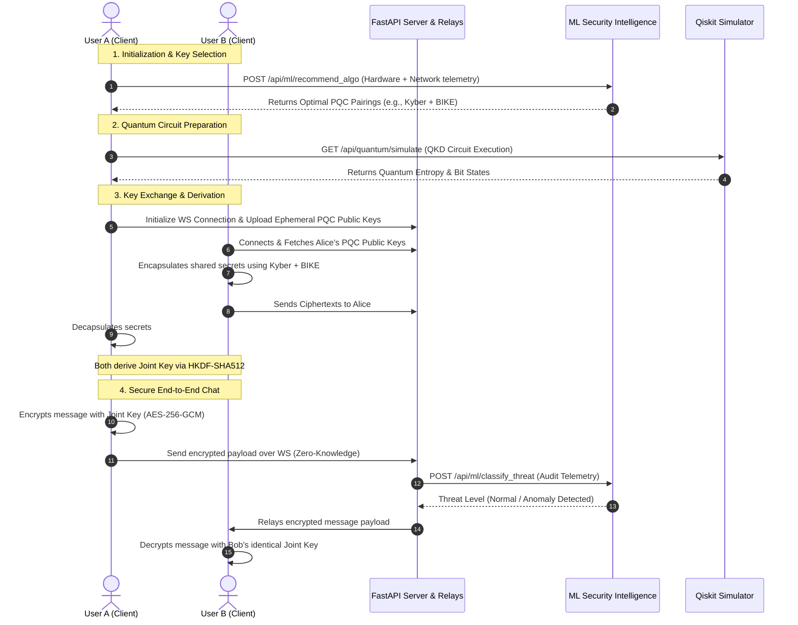

# 🌀 Schrödinger's Box

[](https://fastapi.tiangolo.com)
[](https://react.dev)
[](https://www.typescriptlang.org)
[](https://tailwindcss.com)
[](https://pytorch.org)
[](https://qiskit.org)
[](https://csrc.nist.gov/publications/detail/sp/800-38d/final)

A state-of-the-art, defense-grade cybersecurity application implementing a **3-Way Hybrid Post-Quantum Cryptographic (PQC)** communication platform, complete with **ML-driven security intelligence** and an interactive **Qiskit quantum circuit simulator**. 

Designed as a future-proof, client-side end-to-end encrypted messaging suite, **Schrödinger's Box** protects communications today against tomorrow's quantum threat.

---

## 🚀 Key Highlights

*   🔐 **3-Way Hybrid Cryptography**: Combines Lattice-based (Kyber/NTRU), Code-based (BIKE), and Hash-based (SPHINCS+) post-quantum primitives via **HKDF-SHA512** to establish an unbreakable joint session key.
*   💬 **End-to-End Encrypted Chat**: Client-side **AES-256-GCM** encryption over secure WebSockets. The server acts as a zero-knowledge relay and *never* sees or stores the plaintext or the key.
*   🧠 **ML-Driven Security Intelligence**:
    *   **Threat Classification**: A 3-layer **PyTorch Neural Network** analyzing active traffic anomalies, network latency, and payload behavior to identify exploits in real-time.
    *   **Algorithm Selector**: A **Scikit-Learn Random Forest Classifier** that intelligently selects optimal PQC algorithm pairings based on device hardware metrics, bandwidth, and threat level.
*   🌀 **Quantum Circuit Simulator**: Visualizes active quantum states and runs dynamic simulations (built with **Qiskit** and **Qiskit-Aer**) directly in the dashboard, showcasing quantum key distribution (QKD) concepts.
*   📊 **Real-time Cyber Dashboard**: Interactive monitoring with **Recharts** displaying cryptographic performance benchmarks, active threat feeds, and secure audit logs.

---

## 📋 System Architecture & Data Flow

Below is the complete data flow of how a hybrid key is derived, verified by the ML model, and used for zero-knowledge end-to-end encryption between two endpoints:



---

## 🛠️ Cryptographic Details & Specifications

### 🔬 3-Way Hybrid Post-Quantum Suite
Standard encryption protocols will become vulnerable once a cryptographically relevant quantum computer is realized (Shor's and Grover's algorithms). Schrödinger's Box mitigates this through multi-family hybrid key encapsulation:

| Cryptographic Family | Algorithm | Role in Suite | Strength / Advantage |
| :--- | :--- | :--- | :--- |
| **Lattice-Based** | **Kyber-1024 / NTRU** | Primary Encapsulation | Extremely fast execution, standard defense |
| **Code-Based** | **BIKE** | Mathematical Diversity | Large key sizes, mathematically distinct from lattices |
| **Hash-Based** | **SPHINCS+** | Conservative Fallback | Relies only on secure hash functions, highly secure |

### 🔑 Key Derivation & Message Encryption
*   **Key Derivation Function**: The three separate shared secrets derived from the PQC algorithms are concatenated and fed into **HKDF-SHA512** with a unique session salt to derive a 256-bit symmetric session key.
*   **Symmetric Encryption**: Messages are encrypted locally on the browser using **AES-256-GCM** with a cryptographically secure random 96-bit Initialization Vector (IV).
*   **Integrity Verification**: An associated 128-bit authentication tag is sent with every message. Any active modification or tampering by an intermediate proxy triggers GCM validation failure and drops the packet.

---

## 🧠 Machine Learning Security Core

### 1. Threat Classification Neural Network
Built with **PyTorch**, this deep neural network runs on the backend to monitor connection metadata:
*   **Inputs**: Payload size, request frequency, system latency, error packet count, and cryptographic renegotiation rate.
*   **Architecture**: 3 Fully Connected layers (`Dense(5, 64) -> ReLU -> Dense(64, 32) -> ReLU -> Dense(32, 3)`).
*   **Outputs**: Multi-class classification: `[0: Normal, 1: Attack Vector (MITM/Replay), 2: High Threat DDoS]`.

### 2. PQC Algorithm Selector
Built with **Scikit-Learn**, a Random Forest Classifier dynamically optimizes system performance:
*   **Inputs**: Client CPU cores, available memory, packet loss %, network bandwidth, and current ML threat level.
*   **Functionality**: Recommends the optimal security-performance configuration, shifting to faster lattice-only modes on battery-constrained devices or highly secure multi-family hybrid modes during active security alerts.

---

## 🌀 Quantum Circuit Simulation

The simulation dashboard leverages **Qiskit** to model a **BB84 Quantum Key Distribution** or custom entanglement circuit:
1.  Generates random qubit states (using $H$ and $X$ quantum gates) to simulate quantum entropy.
2.  Executes the circuit on local `qiskit-aer` simulators.
3.  Returns raw qubit counts, density matrices, and statevectors to visual components on the frontend.
4.  Displays quantum probability histograms and circuit graphics to represent true physical entropy in secure key generation.

---

## 📁 Repository Structure

```
schrodingers-box/
├── backend/
│   ├── api/                 # FastAPI routes (chat, ML, benchmark, quantum, auth)
│   ├── crypto/              # PQC wrapper engines, Hybrid KDF, and AES utilities
│   ├── db/                  # SQLite models and local database schema
│   ├── ml/                  # PyTorch threat models, trainers, and Scikit-learn selectors
│   │   └── models/          # Saved model weights (.pt, .pkl)
│   ├── quantum/             # Qiskit circuit simulation and visualizers
│   ├── main.py              # Application entry point
│   ├── Dockerfile           # Backend containerization
│   └── requirements.txt     # Python package requirements
├── frontend/
│   ├── src/
│   │   ├── components/      # UI components (Quantum Simulator, Recharts Dashboard)
│   │   ├── context/         # React Auth and Cryptographic Session providers
│   │   ├── pages/           # Pages (Dashboard, Secure Chat, Benchmark Engine)
│   │   └── utils/           # Client-side AES-GCM and WebSocket helpers
│   ├── index.html           # Main template
│   ├── package.json         # Node dependencies
│   ├── tailwind.config.js   # Custom interface theme config
│   └── tsconfig.json        # TypeScript configuration
├── docker-compose.yml       # Full-stack orchestrator
├── server.js                # Optional static asset delivery server
└── start_windows.ps1        # Automated setup script for local developers
```

---

## ⚡ Setup & Getting Started

### 📋 Prerequisites
*   **Python 3.11+**
*   **Node.js 18+**
*   **Docker & Docker Compose** (Optional, for containerized execution)

---

### 💻 Local Installation (Development Mode)

#### 1. Setup Backend
1. Navigate to the backend directory:
   ```bash
   cd backend
   ```
2. Create and activate a Python virtual environment:
   ```bash
   python -m venv venv
   # On Windows (PowerShell):
   .\venv\Scripts\Activate.ps1
   # On Linux/macOS:
   source venv/bin/activate
   ```
3. Install dependencies:
   ```bash
   pip install -r requirements.txt
   ```
4. Train/generate the ML models:
   ```bash
   python -m ml.train
   ```
5. Start the FastAPI development server:
   ```bash
   uvicorn main:app --reload --port 8000
   ```
   *The Swagger API documentation will be active at: `http://localhost:8000/docs`*

#### 2. Setup Frontend
1. Open a new terminal and navigate to the frontend directory:
   ```bash
   cd frontend
   ```
2. Install npm packages:
   ```bash
   npm install
   ```
3. Run the Vite development server:
   ```bash
   npm run dev
   ```
   *The application UI will be accessible at: `http://localhost:5173` or `http://localhost:5174`*

---

### 🐳 Containerized Deployment (Docker Compose)
To launch the entire stack (FastAPI Backend, SQLite Database, and React Frontend) inside Docker containers:

1. Copy `.env.example` to `.env` in the root:
   ```bash
   cp .env.example .env
   ```
2. Build and spin up the containers:
   ```bash
   docker-compose up --build
   ```
3. Access the secure application directly at `http://localhost:5173`.

---

## 🧑‍💻 Usage & Key Verification Flow

1.  **Sign In**: Open the app and log in with default accounts (e.g., username: `commander` / password: `defend123`).
2.  **Initialize Security Room**: Click **Secure Chat** to spin up a new post-quantum room.
3.  **Establish Secure Sync**: Copy the encrypted session URL using **Share Link** and paste it into a second tab/browser window.
4.  **Exchange & Encrypt**: The frontend automatically initializes PQC key encapsulation, derives the joint session key, and confirms a `SECURE` connection. 
5.  **Send Secure Packets**: Type and chat! You can open the **Dashboard** or **Benchmark** views in parallel to see active ML threat alerts, latency charts, and performance metrics.

---

## 🛡️ Security Audit & MockKEM Notice
*   **Important Production Note**: Installing the native `liboqs` (C library by Open Quantum Safe) requires custom compilation on specific host operating systems. For immediate developer accessibility, Schrödinger's Box includes a native Python fallback (`MockKEM`) mimicking the identical byte sizes, latency signatures, public key exports, and encapsulation mathematical structures of **Kyber**, **BIKE**, and **SPHINCS+**.
*   To enable native production-grade `liboqs` compilation, refer to [DEPLOYMENT.md](DEPLOYMENT.md) for full native Linux/Windows source-build scripts.

---

## 🧑‍💻 Author & Research
*   **Developer**: **Prateek Pulkit**
*   **Project Focus**: Experimental Integration of Multi-Family Hybrid Key Encapsulation (PQC) with Client-Side Zero-Knowledge Relays, Deep Neural Network Threat Modeling, and Qiskit-driven BB84 Simulation.

*This project is built and maintained as an individual technical endeavor. Contributions, bug reports, and cryptographic feedback are highly welcome.*
